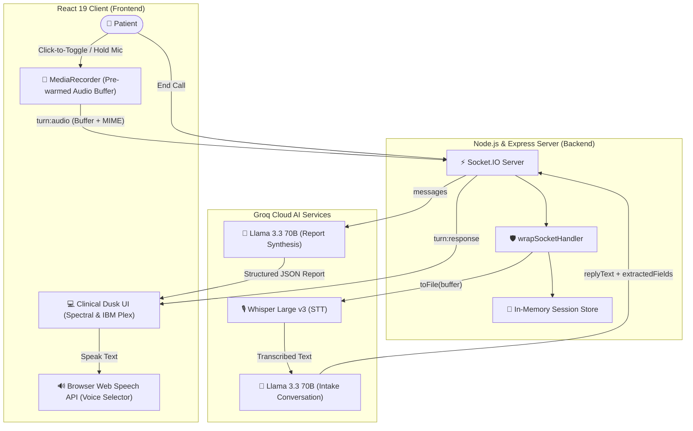

# PulseVoice — Conversational AI Health Screening Web App


**Author:** [Sahil Sameer](https://github.com/SahilSameer18)

---

PulseVoice is a voice-based AI health-screening call web application. Users conduct a live, adaptive health intake conversation with an AI agent (**supporting English, Hindi, and dynamic mid-call language switching**). Upon call completion, the app generates a structured clinical health report summarizing the patient's primary complaint, symptoms, duration, severity, and notable highlights for physician review.

---

## 🏗️ System Architecture (Mermaid Diagram)



---

## 🛠️ Tech Stack

| Layer | Tech / Tool | Description |
|---|---|---|
| **Frontend Framework** | React 19 + Vite | High-performance SPA frontend |
| **Styling & UI** | Tailwind CSS v4 | "Clinical Dusk" theme with custom design tokens |
| **Typography** | Google Fonts | `Spectral` (AI Voice & Brand Serif), `IBM Plex Sans` (UI Body), `IBM Plex Mono` (Report Fields) |
| **Real-Time Transport** | Socket.IO | Bidirectional event communication with strict session tracking |
| **Backend Runtime** | Node.js + Express | REST health checks & WebSocket server |
| **Speech-to-Text (STT)**| Groq Whisper Large v3 | High-accuracy voice transcription with Devanagari & English vocabulary biasing |
| **Intake & Report LLM** | Groq Llama 3.3 70B | Forced JSON mode (`json_object`) with dual-level parsing fallbacks & dynamic language switching |
| **Text-to-Speech (TTS)**| Web Speech API | Browser Web Speech API with async `onvoiceschanged` selector prioritizing native Hindi (`Swara`/`Google हिंदी`) and English (`Jenny`/`Google US`) voices |

---

## 📁 Repository Folder Structure

```
pulseVoice/
├── README.md                           # Project documentation & architecture
├── PLAN.md                             # Phase-by-phase execution plan
├── requirement.md                      # Take-home assessment spec
│
├── client/                             # REACT FRONTEND
│   ├── public/
│   ├── src/
│   │   ├── api/
│   │   │   └── socket.js               # Socket.IO client instance
│   │   ├── components/
│   │   │   ├── call/
│   │   │   │   ├── CallControls.jsx    # Click-to-toggle mic button & action panel
│   │   │   │   ├── AudioVisualizer.jsx # Breathing orb & Pulse Line SVG motif
│   │   │   │   └── TranscriptView.jsx  # Chat captions (Spectral serif for AI text)
│   │   │   ├── common/
│   │   │   │   ├── Header.jsx          # Top navbar header with language selector
│   │   │   │   └── ErrorAlert.jsx      # UI error alert banner
│   │   │   └── report/
│   │   │       ├── ReportCard.jsx      # Paper-texture clinical report card
│   │   │       ├── SymptomsList.jsx    # Primary complaint & symptom chips
│   │   │       └── RiskFlags.jsx       # Highlights for physician review (non-diagnostic)
│   │   ├── constants/
│   │   │   ├── callStatus.js           # CALL_STATUS enum constants
│   │   │   └── languages.js            # English, Hindi & Auto-Detect config
│   │   ├── context/
│   │   │   └── CallContext.jsx         # React global call state provider
│   │   ├── hooks/
│   │   │   ├── useRecorder.js          # Pre-warmed MediaRecorder audio capture hook
│   │   │   ├── useSpeechSynthesis.js  # Web Speech API TTS speaker hook
│   │   │   └── useSocket.js            # Socket event binding hook
│   │   ├── pages/
│   │   │   ├── HomePage.jsx            # Hero landing page with animated pulse line
│   │   │   ├── CallPage.jsx            # Screening call interface page
│   │   │   └── ReportPage.jsx          # Health summary page with session rhythm strip & Cancel CTA
│   │   ├── app.layout.jsx              # Main App layout wrapper
│   │   ├── app.routes.jsx              # React Router definitions
│   │   ├── App.jsx                     # Root React component
│   │   └── index.css                   # Clinical Dusk design system & fonts
│   ├── package.json
│   └── vite.config.js
│
└── server/                             # NODE.JS BACKEND
    ├── src/
    │   ├── middlewares/
    │   │   └── errorHandler.js       # wrapSocketHandler async error wrapper
    │   ├── prompts/
    │   │   ├── systemPrompt.js       # Dynamic AI intake persona prompt with language adaptation
    │   │   └── reportPrompt.js       # Report synthesis JSON prompt
    │   ├── services/
    │   │   ├── groqClient.js         # Shared Groq SDK client
    │   │   ├── groqStt.js            # Whisper STT with dynamic MIME toFile helper
    │   │   ├── groqChat.js           # Llama intake service with JSON mode
    │   │   └── groqReport.js         # Llama report service with schema fallback
    │   ├── sockets/
    │   │   ├── index.js              # Socket server registration
    │   │   └── callHandler.js        # Wired STT -> LLM -> Report pipeline
    │   ├── store/
    │   │   └── sessionStore.js       # In-memory session tracking store
    │   └── utils/
    │       ├── audioHelper.js        # Silence detection (3KB threshold)
    │       └── fieldExtractor.js     # Unfilled fields & substantive call check
    ├── testGroq.js                     # Live Groq API integration test suite
    ├── testPhase6.js                   # Local edge-case unit test suite
    ├── .env.example
    ├── package.json
    └── server.js                       # Express + Socket.IO server entry point
```

---

## ⚡ Setup & Running Instructions

### Prerequisites
- **Node.js**: `v18.x` or higher
- **Browser**: Google Chrome or Microsoft Edge (best Web Speech API & MediaRecorder support)
- **Groq API Key**: Obtain a key from [Groq Console](https://console.groq.com)

---

### Step 1: Clone Repository
```bash
git clone https://github.com/SahilSameer18/pulseVoice.git
cd pulseVoice
```

---

### Step 2: Backend Setup (`server/`)
```bash
cd server
npm install
```

Create a `.env` file in `server/` (refer to `.env.example`):
```env
GROQ_API_KEY=gsk_your_real_groq_api_key_here
PORT=3000
CLIENT_URL=http://localhost:5173
```

Start the backend server:
```bash
npm run dev
# Server running at http://localhost:3000
```

---

### Step 3: Frontend Setup (`client/`)
In a new terminal window:
```bash
cd client
npm install
npm run dev
# App running at http://localhost:5173
```

---

### Step 4: Testing & Verification Suites
The repository includes two separate test suites:
- **Local Edge-Case Test (`node testPhase6.js`)**: Runs locally without requiring external API calls. Tests audio silence detection (<3KB), brief call report fallbacks, and socket session memory cleanup.
- **Live Groq Integration Test (`node testGroq.js`)**: Requires a valid `GROQ_API_KEY` in `.env`. Verifies live Whisper STT audio transcription, Llama 3.3 structured chat responses, and clinical report JSON synthesis.

---

## 🛡️ Failure Handling & Safeguards

PulseVoice incorporates defensive architecture against runtime failures:

1. **Pre-warmed Low-Latency Mic**: Microphone permissions are pre-requested on mount, eliminating hardware audio warmup delay when recording starts.
2. **Dynamic Language Switching**: Patients can switch between English and Hindi mid-call; the AI immediately adapts its spoken language on that turn.
3. **Silence & Small Audio Filter**: Audio buffers under 3,000 bytes (~200ms) are caught locally before hitting Groq API: *"Audio too short — likely silence or noise. Please speak clearly and try again."*
4. **Unclear Speech Recovery**: If Whisper returns an empty transcript, the system prompts the user to repeat without dropping the call.
5. **Dual-Shield LLM JSON Fallback**: `groqChat.js` and `groqReport.js` use `response_format: { type: "json_object" }` combined with `parseLlamaJson` regex fallbacks. If parsing fails, raw text is used gracefully without UI crashes.
6. **Brief Call Handling**: Calls ended after 0-1 turns are detected via `isCallSubstantive(messages)`. Generates a graceful limited report stating minimal info was collected without inventing fake data.
7. **Non-Diagnostic Framing**: Highlights are framed as *"Notable Highlights for Physician Review"* with non-diagnostic disclaimers.
8. **Session Memory Cleanup**: Socket sessions are destroyed on `call:end` and `disconnect` events to prevent backend memory leaks.

---

## 👤 Author

**Sahil Sameer**  
- GitHub: [@SahilSameer18](https://github.com/SahilSameer18)  
- Project Repository: [https://github.com/SahilSameer18/pulseVoice](https://github.com/SahilSameer18/pulseVoice)
